# Title: Interface Testing Task I, II, III

# Author: Caesar James LEE

# Date: February 1st, 2026

## Screenshots

### Task I

#### 1-1變數url值截圖

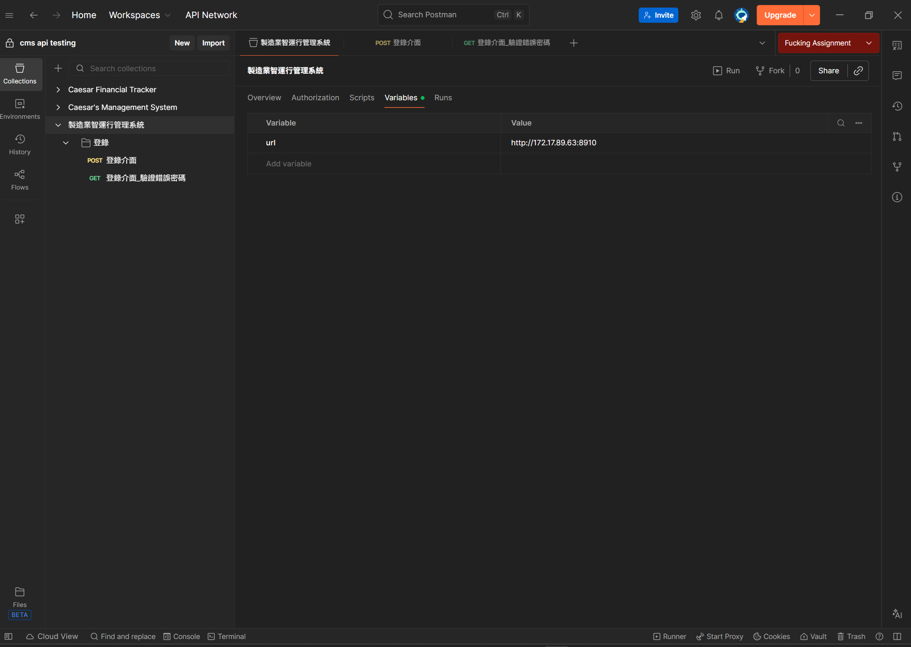

#### 1-2token關聯代碼截圖

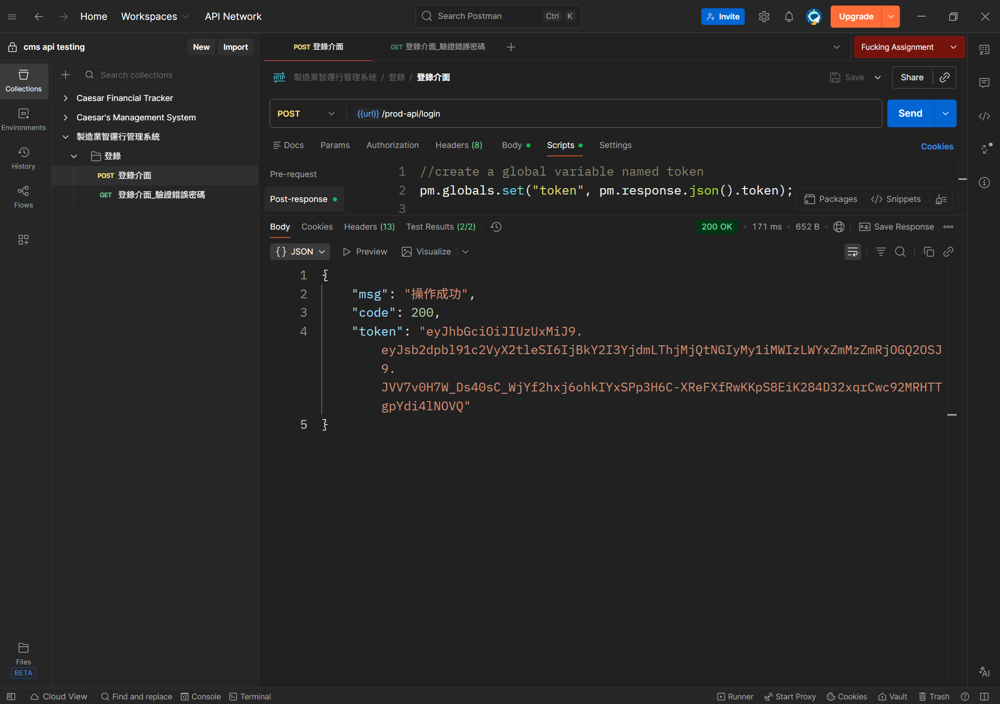

#### 1-3登錄成功\_變數ZG_token值截圖

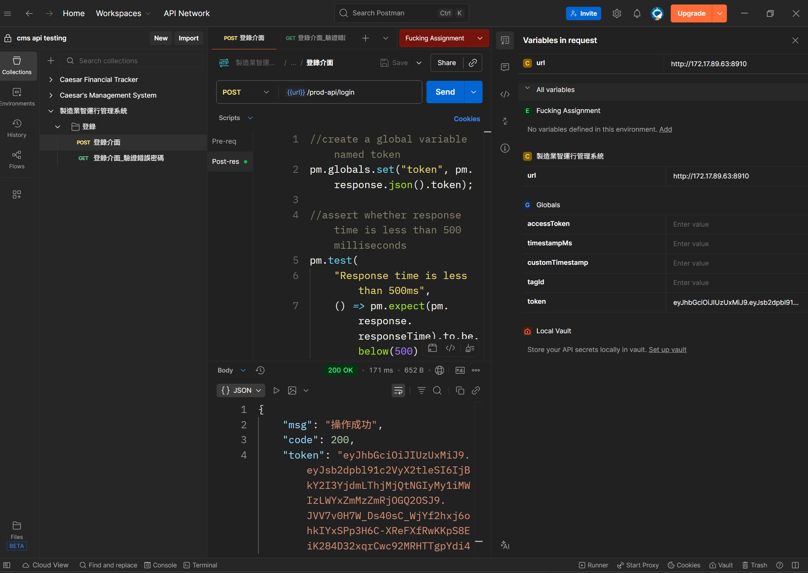

#### 1-4登錄成功\_斷言

#### 1-5登錄失敗\_請求設置

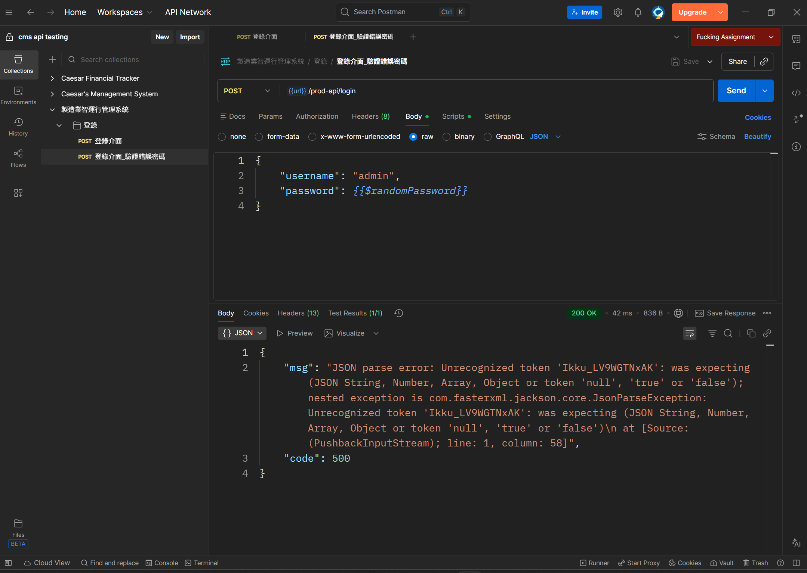

#### 1-6登錄失敗\_斷言

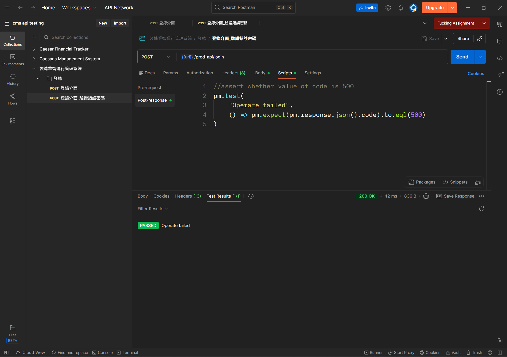

### Task II

#### 2-1物料檔案新增（成品）\_請求設置

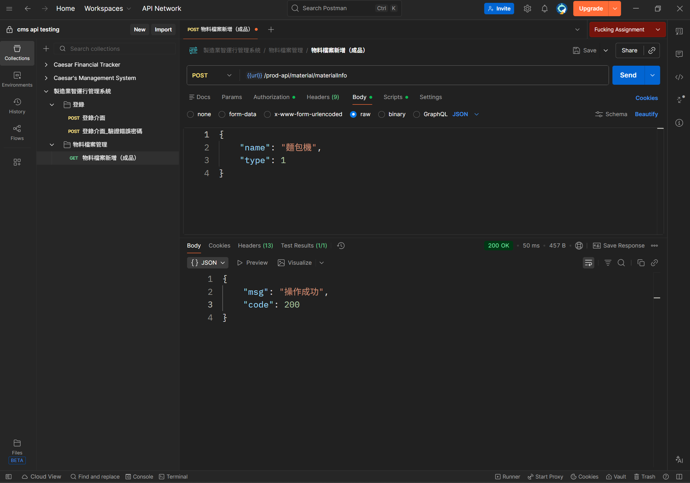

#### 2-2物料檔案新增（成品）\_斷言

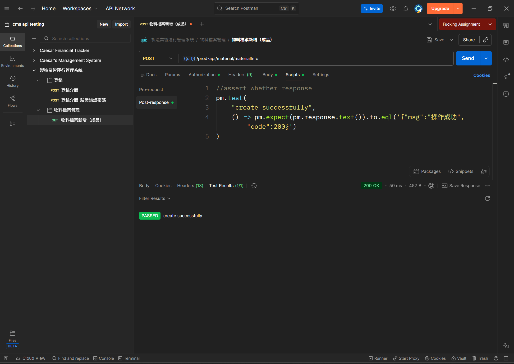

### Task III

#### 3-1物料檔案清單\_請求設置

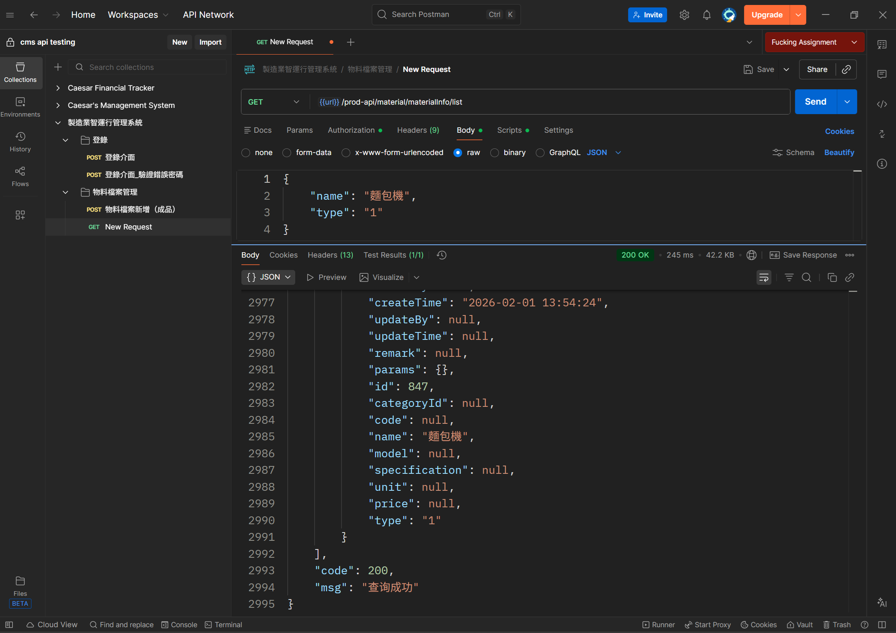

#### 3-2物料檔案清單\_關聯配置

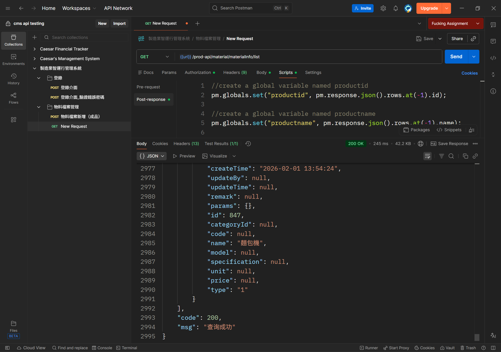

#### 3-3物料檔案清單\_斷言

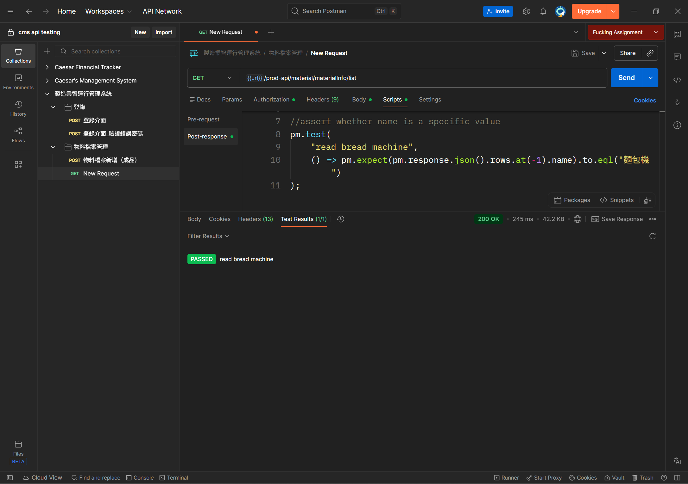

#### 3-4productname變數

#### 3-5productid變數

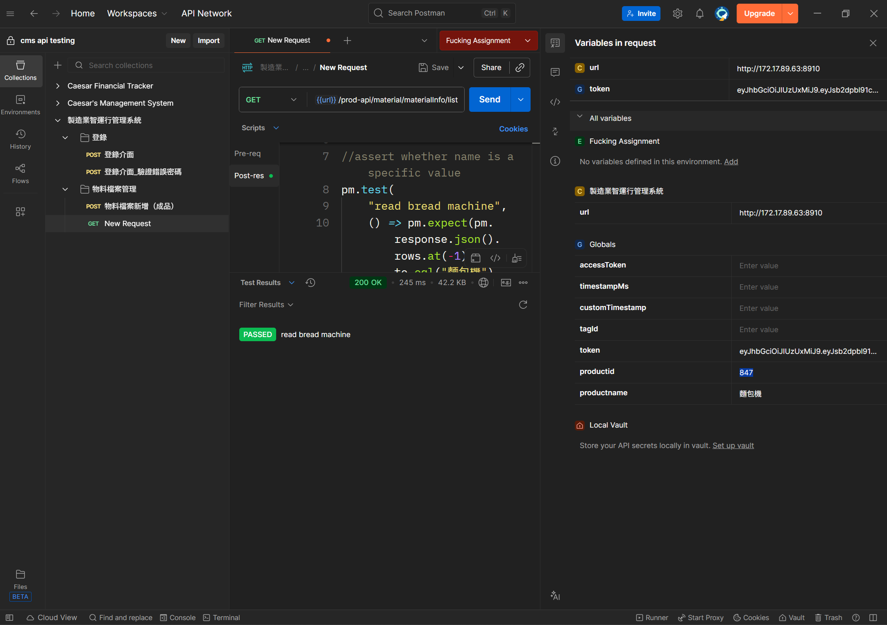
