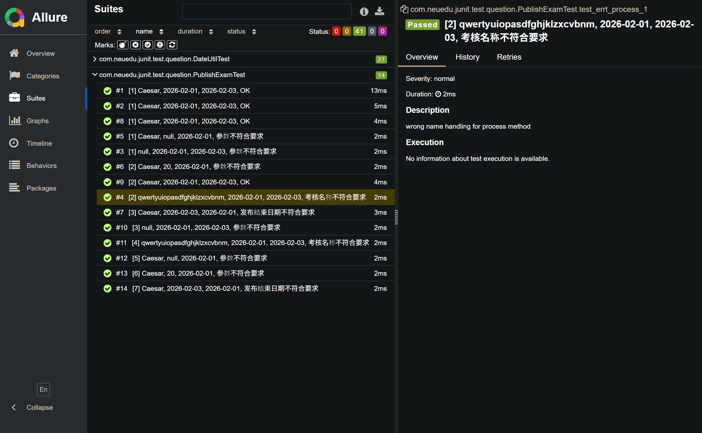

# Title: Unit Testing

# Author: Caesar James LEE

# Date: February 3rd, 2026

## Screenshots

### Project Structure

### `Allure` Report

## Commands

1. `cd path/junit-test`: go to the project
2. `java --version`: verify `Oracle Java` version
3. `mvn --version`: verify `Apache Maven` version
4. `rm -rm allure-tmp/*`: remove all old test records if created
5. `mvn clean test`: clean all old and changed `.class` files, and then compile all classes using `javac`
6. `allure --version`: verify `Allure` version
7. `allure generate allure-tmp -o report --clean`: clean old report data, and re-generate an `Allure` report using `allure-tmp`
8. `allure open -h 127.0.0.1 -p 8964 report` || `allure open report`: create a local server to render `Allure` report in `1270.0.0.1:8964` or `127.0.0.1:63692` by default
